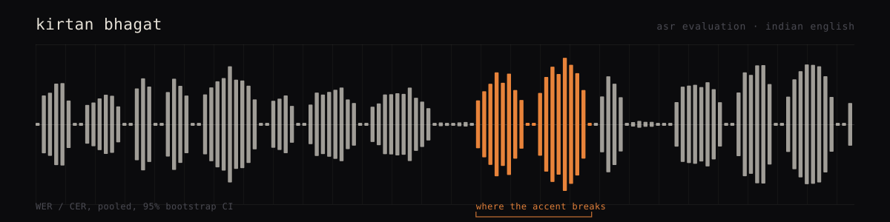

# Kirtan Bhagat

I build evaluation tooling for speech recognition, mostly around how badly ASR
models handle accents they were never trained on.

Self-taught, based in India. Most of what I know came from reading source code
and breaking things.

---

## whisperflow-for-indian-english-benchmark

A reproducible harness for measuring Whisper's transcription accuracy on
Indian-accented English, broken down by the speaker's first language instead of
averaged into one number.

Whisper's published English error rates come almost entirely from American and
British speech. India has the second-largest English-speaking population on
earth, spread across dozens of first-language backgrounds that shape the accent
in completely different ways, and the published numbers say close to nothing
about any of them.

The hard part turned out to be scoring, not inference. A standard WER tool
reads this as a total failure:

| Reference | Whisper output | Naive WER | Actually |
| --- | --- | --- | --- |
| two lakh fifty thousand rupees | Rs. 2,50,000 | 100% | Correct |
| the colour of the centre | the color of the center | 50% | Correct |

Both are perfect transcriptions. The first uses Indian digit grouping, where
`2,50,000` means 250,000 and Western parsers get it wrong. The second is
British spelling against a model trained on American text. Neither is a
mishearing, and counting them as errors buries the signal you actually want.

What the harness does:

- Pooled corpus-level WER and CER, not the mean of per-utterance rates, which
  over-weights short clips and is the most common way ASR numbers get inflated
- 95% bootstrap confidence intervals, so a two-point gap between models can be
  checked against noise before anyone reports it
- Substitutions, deletions and insertions counted separately, because a model
  that drops audio and one that hallucinates text fail differently
- Per-utterance caching, so changing a normalization rule rescores the whole
  benchmark in seconds instead of re-running hours of inference
- Runs under both PyTorch and CTranslate2, since the same weights score
  differently under different runtimes

Python. The scoring path uses nothing outside the standard library, so the test
suite runs in seconds without a model stack installed.

No headline Whisper numbers are published yet. The harness is finished and
tested; what's missing is accent-labelled audio with redistribution terms clear
enough to publish against. Filling the table with numbers from a corpus nobody
can check would defeat the point.

---

## instagram-saves-engine _(local, not published)_

Pulls Instagram saved posts into Notion twice a day on a launchd timer, then
turns them into content ideas on demand. Python, the Instagram web API, and the
Notion client. Keeps a synced-ID state file so reruns don't duplicate rows.

---

## Tools

`Python` · `pytest` · `ruff` · `PyTorch` · `CTranslate2` · `OpenAI Whisper` ·
`Git` · `GitHub Actions` · `YAML` · `Bash`

---

## Reach me

- Email: [kirtanbhagat.mb@gmail.com](mailto:kirtanbhagat.mb@gmail.com)
- Issues and PRs on any repo here

Open to contributions on the benchmark, particularly accent-labelled samples
and normalization rules for phenomena it currently misses.
